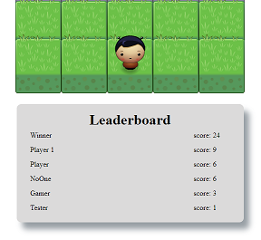

# Classic arcade game - Frogger
This game is based on the classic arcade game Frogger with provided visual assets and a game loop engine by adding a number of entities to the game including player characters and enemies.

## Game Description
The game canvas consists of 5x6 grid. In this game you have a Player and Enemies (Bugs). The goal of the player is to reach the water, without colliding into any one of the enemies. The player can move left, right, up and down. The enemies move in varying speeds on the paved block portion of the scene.

Once the player reaches the water:
 * The score of game is increase,
 * the player return back to the start square,
 * enemies increase their minimal speed (until minimal speed is equal to maximal speed),
 * increase number of enemies when score is 2,5,9 or 12.

 Once a the player collides with an enemy:
 * The game (score, number of enemies) is reset,
 * the player moves back to the start square,
 * you can save game stats to the leaderboard.

## Screenshots




## Quickstart
Clone from GIT repository.
```
$ git clone https://github.com/PeMajer/project-6-Arcade-Game
```
Open `index.html` in your browser.

## Leaderboard
If you win game, you can save game stats to the leaderboard. Leaderboard stores game state using local storage.


## External
Use [Sweet Alert 2](https://github.com/limonte/sweetalert2) to create popup window when win a game.

## Contributing
* Fork the repository.
* Create a branch for the work you’re going to do.
* Make your changes in your branch.
* Send a pull request from your branch to this repository.

## License
It is free software, and may be redistributed under the terms specified in the [license file](LICENSE.md).

